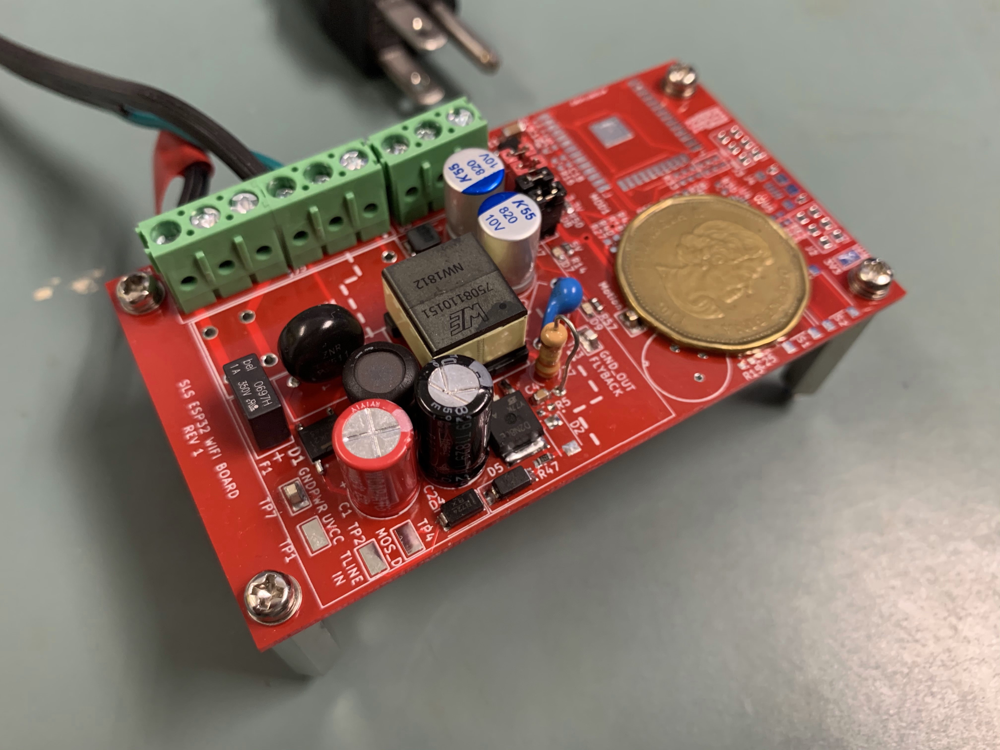

# Smart Light Switch PCB
This board is powered by Flyback converter, converting 120VAC to 5VDC to power the ESP32 microcontroller. The onboard temperture sensor and montion sensor would be used for smart home configrations 
## Flyback Converter Schematic

## PCB

## Rev 1 Flyback Assemble PCB

## Kicad
This project uses Kicad to draw schematic and PCB
You can download [Kicad](https://kicad.org/) and open SLS_rev1.pro

### Digikey Library
I used digikey kicad Library to place most of the components:
https://www.digikey.ca/en/resources/design-tools/kicad

## Blog Post

I wrote some blog post talk about flyback controller, you can check them out below:

 <a target="_blank" href="https://github-readme-medium-recent-article.vercel.app/medium/@charingchen/0">
 
 <a target="_blank" href="https://github-readme-medium-recent-article.vercel.app/medium/@charingchen/1"> 
