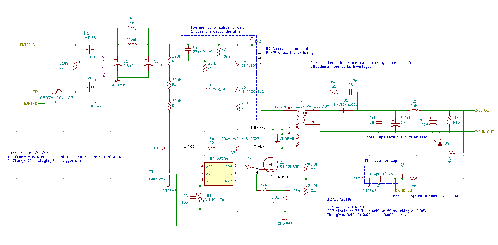
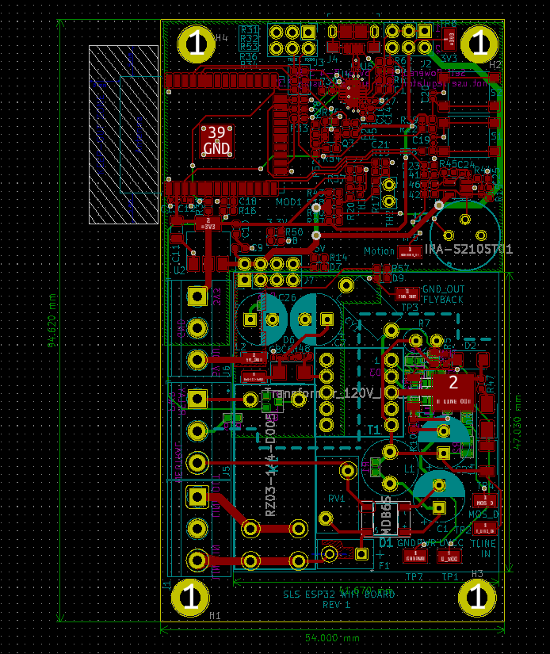
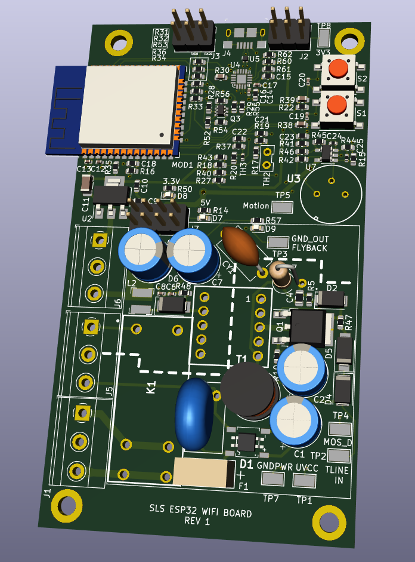

# Smart Light Switch PCB
This board is powered by Flyback converter, converting 120VAC to 5VDC to power the ESP32 microcontroller. The onboard temperture sensor and montion sensor would be used for smart home configrations 

## Kicad

### Digikey Library

##

## BOM
